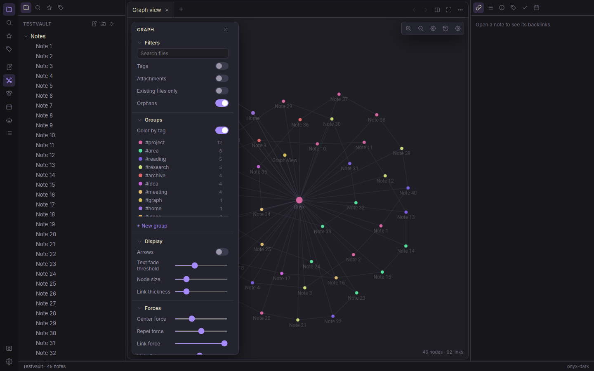

# Onyx Desktop

An Obsidian-style desktop app for the same vault the Onyx TUI edits. Same folder,
same plain `.md` files, same `.onyx/` sidecar — you can leave both running at once
and each picks up the other's changes.



## Run it

```bash
cd desktop
npm install
npm run dev          # hot-reloading dev build
npm start            # run the production build
npm run build        # build only, into desktop/out
```

## Install

Packaging is electron-builder; artifacts land in `desktop/release`.

```bash
npm run pack:linux       # AppImage + deb
npm run pack:win         # NSIS installer + portable zip  (needs Wine on Linux)
npm run pack:win:docker  # …or build it from Linux with no Wine installed
npm run pack:mac         # dmg
```

`pack:win` from Linux needs Wine, because electron-builder patches the .exe's icon
and version info with rcedit. `pack:win:docker` avoids installing it by running the
same build inside electron-builder's own image (which ships Wine), as your own user
so nothing in the tree ends up owned by root. Artifacts land in `release/` either way:
`Onyx-<version>-x64.exe` (NSIS, per-user, installable to a chosen directory) and
`Onyx-<version>-x64.zip` (portable).

On Linux, the `.deb` installs to `/opt/Onyx`, registers `onyx-desktop.desktop`
and drops the icon into `hicolor` at every size, so Onyx shows up in the
application menu like any other app:

```bash
sudo dpkg -i release/onyx-desktop_0.1.0_amd64.deb
```

No root? `scripts/install-linux.sh` does the same thing under `~/.local` — copies
the unpacked build to `~/.local/lib/Onyx`, symlinks `~/.local/bin/onyx-desktop`,
and writes a desktop entry with the icon set. `--uninstall` reverses it. This is
also the way to go on **WSL**, where the AppImage can't self-mount (no FUSE):

```bash
npm run pack:linux
./scripts/install-linux.sh
```

The AppImage is self-contained where FUSE exists — `chmod +x` it and run.
Elsewhere use `--appimage-extract-and-run`.

The icon lives in `assets/onyx-icon.svg`; `build/icon.png` and `build/icons/*` are
generated from it:

```bash
mkdir -p build/icons
convert -background none -density 384 ../assets/onyx-icon.svg -resize 512x512 build/icon.png
for s in 16 24 32 48 64 128 256 512; do
  convert -background none -density 384 ../assets/onyx-icon.svg -resize ${s}x${s} build/icons/${s}x${s}.png
done
```

On first launch it opens the vault from `~/.config/onyx/desktop.json`, falling back
to `last_vault` in the TUI's `config.toml`, then to `~/OnyxVault`. Use the vault icon
at the bottom of the ribbon (or `Ctrl+Shift+O`) to switch.

> **Running on WSL, a VM, or a headless box?** The graph needs WebGL2. If the GPU
> process can't start, launch with `--enable-unsafe-swiftshader` to render it in
> software.

## What's in it

**Workspace** — the window remembers its size, position and maximized state and
restores them next launch (checked against the displays that currently exist, so a
window saved on a monitor you've since unplugged still opens somewhere visible).
Plus a ribbon, editor tabs (drag to reorder or move between panes),
horizontal splits, per-pane back/forward history, full-screen focus (`Ctrl+F`),
status bar, and five themes ported from the TUI's `theme.rs`.

The sidebars follow the **TUI's layout** rather than Obsidian's: each side is a
vertical stack of panes, not one visible tab at a time.

| | Panes |
|---|---|
| Left | Files · Quicknote · Todo |
| Right | Backlinks · Graph · Calendar |

The docked Graph is the **whole vault graph** — the same view as the Graph tab,
sharing its settings, with the note you're reading highlighted. It runs as a
minimap: shorter springs so a large vault stays legible in a narrow pane, no
control panel, and the simulation freezes once it settles rather than drifting in
the background. The maximize button in its header opens the full tab.

Click a header to collapse a pane, drag the divider below it to resize (double-click
to make it flexible again), and right-click the sidebar background to show or hide
panes — Bookmarks, Outline, Tags and Properties are available but hidden by default.
The ribbon toggles individual panes, and everything persists. Search opens as a
full tab (`Ctrl+Shift+F`), the way the TUI's full-screen search does.

**Editor** — CodeMirror 6 with Obsidian's three modes:

| Mode | What you see |
|---|---|
| Live Preview (default) | Rendered markdown; raw syntax appears only on the construct your cursor is touching |
| Source | Everything raw, with syntax highlighting |
| Reading (`Ctrl+E`) | Fully rendered, no editing |

Live Preview renders headings, bold/italic/strike/`==highlight==`, inline code and
fenced blocks, blockquotes, task checkboxes (clickable), images, links, `[[wikilinks]]`,
`#tags`, horizontal rules, callouts, and the frontmatter properties table.
`[[` opens the note autocomplete, `#` the tag autocomplete, and `/` at the start of a
line opens the slash menu (headings, lists, tables, callouts, columns, math, …).
Vim keybindings are a toggle in Settings → Editor.

**Graph** — see below.

**Canvas** — Obsidian's open [JSON Canvas](https://jsoncanvas.org) format, so `.canvas`
files move between the two apps. Text cards (markdown-rendered), note cards, link
cards, groups, and labelled arrow edges; pan, zoom, multi-select, drag, resize, and
connect by dragging a side handle.

**Search & navigation** — full-vault search with `tag:` / `path:` / `file:` / `line:N`
operators and `-exclusions`, fuzzy quick switcher (`Ctrl+O`), command palette
(`Ctrl+P`), backlinks with unlinked mentions, outline, properties, and a tag index.

**Onyx extras** — the Quicknote scratchpad and Todo checklist (same `.onyx/*.md`
files as the TUI, including the `<!--done:YYYY-MM-DD-->` markers and the one-week
sweep), a daily-notes calendar, and database views that render any folder as a
Notion-style table or kanban board keyed by frontmatter.

**Google Calendar & Tasks** — optional, and set up once for both apps. Calendar
events appear as dots on the calendar pane; select a day for its agenda, and add or
delete all-day events from there. Google Tasks merge into the Todo pane below your
local todos, with completed ones struck through and sunk to the bottom; ticking a box
writes straight back, and prefixing a new todo with `g ` creates it in Google instead
of the vault. Both are toggleable in Settings → Google.

Credentials and the token are shared with the TUI: the OAuth client comes from
`[google]` in `~/.config/onyx/config.toml` (or Settings → Google, which takes
precedence), and the token is the same `~/.config/onyx/google.json` at mode 600.
Authorize in either app and the other one is already signed in. The flow is the
installed-app loopback one — the browser opens, and Google redirects back to
`127.0.0.1` on a one-off port. See [`../docs/CLOUD_SYNC.md`](../docs/CLOUD_SYNC.md)
for creating the Desktop-app client.

**Google Drive** — a browser for your Drive (ribbon → cloud, or the "Open Google
Drive" command). Navigate folders, search by name, and open a text file straight
into an editor tab: it behaves like any other tab, and saving `PATCH`es the content
back to Drive rather than writing to the vault. PDFs and images are downloaded to a
temp file and handed to the system viewer. You can also upload the note you're
reading, copy a Drive file into the vault as a note, create folders, and move files
to the Drive trash. Google-native Docs/Sheets/Slides are listed but greyed out —
they need an export conversion, and Onyx shouldn't pretend it can round-trip an edit
back into one.

**AI** — the local-LLM assistant over Ollama: streaming chat with the open note as
context, `/summarize`, `/index` + `/ask` (semantic RAG with cited sources, cached to
`.onyx/rag-index.json`), rewrite-in-place, and inline ghost-text autocomplete
(Tab to accept). No cloud, no keys. See [`../docs/AI.md`](../docs/AI.md).

## The graph view

This is the piece that was built to match Obsidian exactly.

**Rendering.** WebGL2, three instanced draw calls per frame (links, arrowheads,
nodes). Circles are signed-distance discs in the fragment shader, so they stay crisp
at any zoom without a texture atlas; links are camera-space quads so thickness stays
constant in screen pixels. Labels are drawn on a 2D overlay canvas, where the
browser's font rasterizer beats anything an SDF atlas would produce.

**Layout.** d3-force's model — Barnes-Hut many-body charge, link springs, a weak pull
toward the origin, Verlet integration with a cooling `alpha` — running in a Web
Worker. Charge is `0.0033 × linkDistance²` per unit of Repel force, d3's own
charge-to-distance ratio and therefore the proportions Obsidian shows, with a cutoff
at 12× the link distance so distant clusters stop inflating each other. The camera
frames the layout while it grows and stops once the bounding box holds still — not
on a timer, since a 46-node graph settles in a second and a 1500-node one doesn't. Positions ping-pong back on a transferable `Float32Array`, so a large vault
costs no per-frame allocation and never blocks the UI.

Repulsion is scaled as `0.011 × linkDistance²`, which is the equilibrium of one
spring against one charge at `d ≈ 1.1 × linkDistance`. That keeps the two forces
comparable, so moving the distance slider spreads the graph out instead of making it
collapse or explode.

**Controls** — the same four panels, with the same names and ranges:

| Panel | Controls |
|---|---|
| Filters | Search files · Tags · Link nested tags · Attachments · Existing files only · Orphans |
| Groups | **Color by tag** + legend · any number of search-query → color groups |
| Display | Arrows · Text fade threshold · Node size · Link thickness |
| Forces | Center force · Repel force · Link force · Link distance |

**Tags are on by default.** Obsidian ships this filter off, but it's the mechanism
that makes a tag-organised vault legible: each tag becomes its own node and notes
link to it, so notes sharing a tag cluster together. (Obsidian never joins two notes
directly because they share a tag, and neither does this.) A vault where 9% of notes
have wikilinks but half have tags is nearly empty with the filter off.

**Link nested tags** goes one step beyond Obsidian: it joins `a/b` to `a`, so a
hierarchy like `Electromagnetism/Optics/waveOptics` reads as one tree rather than
unrelated islands. Off by default.

**Color by tag** (on by default, and the other place this goes beyond Obsidian)
colors every node by its tag, with a legend under Groups showing each tag, its
color and how many nodes carry it — click a row to filter the graph to that tag.

A tag's color comes from a hash of its *top-level segment*, so `project/web` and
`project/api` share a hue and read as one family, and a color never shifts because
notes or tags were added elsewhere. Hues are spread by the golden angle, so a vault
with hundreds of tags still gets visually distinct colors without a fixed palette.
A note with several tags takes the alphabetically first one — deterministic, so its
color doesn't change when some *other* note is edited. An explicit group still wins
over the tag color, and the focused note keeps its accent highlight.

Local graph adds Depth (1–5), Incoming links, Outgoing links and Neighbor links.
"Restore default settings" resets the panel. Settings persist per view.

The filter and group queries run through the same full-text search as the search
pane, so `tag:project`, `path:Notes/`, and plain content terms all work.

**Interaction** — hover highlights a node and its neighbours and dims everything
else; click opens the note (`Ctrl`/`Cmd`-click for a new tab); drag pins a node while
you hold it; the wheel zooms about the pointer; `+`/`-` zoom and the arrow keys pan
(hold Shift to move faster); right-click gives Open / Open in new tab / Open local
graph / Filter to this folder. Labels fade out as nodes get small on screen, with the
threshold slider shifting when that happens. The camera frames the layout while it
settles, then hands control over the moment you touch it.

## Vaults on slow or remote filesystems

Two things make a vault on a WSL share, `/mnt/c`, or an SMB mount behave:

**Note text is cached in memory.** Full-vault scans — search, unlinked mentions —
read through that cache instead of the disk. Measured on a 1090-note vault, reading
every note costs 0.02s locally, ~2.3s over `/mnt/c`, and 11.5s over
`\\wsl.localhost`; search used to pay that on *every query*. Single-file reads
(opening a note) still go to disk, so they stay correct even when the watcher can't
see external edits.

**The watcher polls when it has to.** Neither direction of the WSL boundary
propagates change notifications — verified in both directions — so `watchMode: auto`
detects the filesystem (UNC on Windows, `/proc/mounts` elsewhere) and switches
chokidar to polling. The status bar shows `polling` when it does; click it, or press
`F5`, to force a re-scan. Force the behaviour either way with `watchMode` in
`desktop.json`.

Startup still pays a full read, so a big vault across the WSL boundary takes a while
to open. If that's your setup, keeping the vault on the same side as the app you use
most is still the better answer.

## Architecture

```
src/
  main/        Electron main process — the only code that touches the disk
    vault.ts     scan, index, resolve links, backlinks, tags, graph, atomic saves, watcher
    search.ts    full-text search, unlinked mentions, fuzzy scoring
    settings.ts  ~/.config/onyx/desktop.json (seeded from the TUI's config.toml)
    ai.ts        Ollama chat/embed/generate + the RAG index
    index.ts     window, menu, IPC handlers, path validation
  preload/     the contextBridge surface (`window.onyx`) — the whole API in one file
  shared/      code both processes use: markdown parsing, types, graph defaults
  renderer/src
    store.ts     workspace state (panes, tabs, buffers, sidebars)
    commands.ts  every command, its hotkey, and its behaviour
    themes.ts    palettes → CSS custom properties
    editor/      CodeMirror live preview, completions, ghost text, HTML renderer
    graph/       WebGL renderer, physics worker, the view and its control panel
    canvas/      JSON Canvas board
    components/  shell, sidebars, modals, settings, database, AI pane
```

The renderer runs with `contextIsolation` on, `nodeIntegration` off, and a strict CSP.
Every filesystem call goes through IPC, and the main process rejects any path that
resolves outside the open vault. Rendered markdown is sanitized before it reaches the
DOM (script/iframe/handler stripping) on top of the CSP.

`shared/parse.ts` is a faithful port of the TUI's `src/markdown/parse.rs`, so both
apps agree on what counts as a link, a tag, or a property.

## Known gaps

- No plugin API, no sync, no publish, no mobile — those are Obsidian features with no
  Onyx equivalent yet.
- Google-native Docs/Sheets/Slides can be browsed but not opened (they need an
  export conversion rather than a download).
- Canvas supports the JSON Canvas spec's node and edge kinds, but not portal/embedded
  canvas nodes.
- Google Calendar / Tasks / Drive (the TUI's `cloud` feature) aren't wired into the
  desktop app yet.
